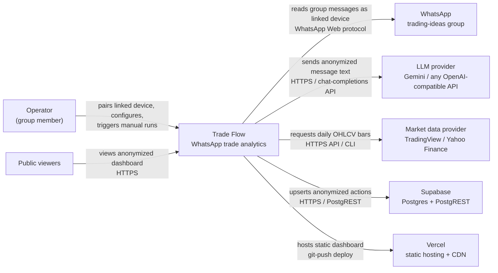
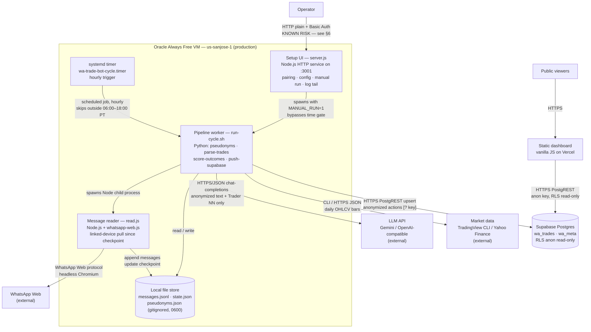
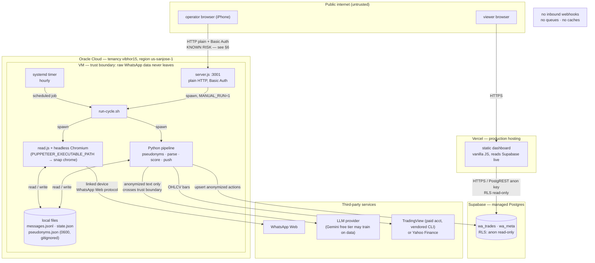

# Trade Flow — C4-style architecture documentation

*Scope: the WhatsApp trade-ideas analytics system ("Trade Flow"), production state as of 2026-09-14. Nothing below is invented; unverified details are marked **[?]** and collected in §6.*

## 1. Architecture summary

- **What it is:** a read-only analytics pipeline that turns messages from a WhatsApp trading-ideas group (~36 active posters) into an anonymized public dashboard of trades, outcomes, and trader stats. It has no brokerage connection and never places trades.
- **System boundary:** all compute and raw data live on a single Oracle Always Free VM (tenancy vibhor15, us-sanjose-1). Everything else — WhatsApp, the LLM provider, market-data providers, Supabase, Vercel — is external.
- **Major containers:** (1) a whatsapp-web.js linked-device reader (`read.js`); (2) a Python pipeline (`pseudonyms.py`, `parse-trades.py`, `score-outcomes.py`, `push-supabase.py`, `build-dashboard.py`) orchestrated by `run-cycle.sh`; (3) a Node.js setup UI (`server.js`) on TCP 3001; (4) a static vanilla-JS dashboard hosted on Vercel.
- **Data stores:** local JSONL/JSON files on the VM (`messages.jsonl`, `state.json` checkpoint, `pseudonyms.json` identity map — gitignored, mode 0600); Supabase Postgres (`wa_trades`, `wa_meta`) as the only cloud store, exposed to the dashboard via an anon key with RLS read-only.
- **External dependencies:** WhatsApp Web (linked device via headless Chromium), an OpenAI-compatible LLM API (Gemini free-tier default), market data (TradingView via a vendored CLI using the operator's paid account, or Yahoo Finance), Supabase, Vercel CDN.
- **Scheduling:** a systemd timer (`wa-trade-bot-cycle.timer`) fires hourly; cycles self-skip outside 06:00–18:00 America/Los_Angeles ("no overnight processes"). A setup-UI manual run sets `MANUAL_RUN=1` and bypasses the time gate. The former Hatch hourly cron was disabled 2026-09-14 — Oracle is the sole refresh path.
- **Data flows:** WhatsApp messages → checkpointed pull → sender anonymization to stable `Trader NN` labels → LLM trade extraction → 5-trading-day outcome scoring → anonymized upsert to Supabase → dashboard reads live via PostgREST. Code deploys (Vercel, on git push) are decoupled from data refreshes (Supabase, hourly).
- **Privacy design:** raw sender identities and phone-like strings are stripped *before* the LLM call; the LLM sees message text plus `Trader NN` labels only. `pseudonyms.json` never leaves the VM and never enters git. Residual risk: names written *inside* message bodies (e.g. "thanks Rahul") are not scrubbed.
- **Known limits:** ingestion is capped per-cycle (`MAX_MESSAGES_PER_CYCLE`, default 200, hard ceiling 1000) — not per-hour; scoring failure is non-fatal and never blocks publishing; the setup UI listens on 0.0.0.0:3001 over plain HTTP (known exposure, mitigations pending).

## 2. System context diagram



No internal implementation details shown; all boxes outside Trade Flow are external systems the product does not control.

## 3. Container diagram



**[?]** Which Supabase credential `push-supabase.py` uses (service_role vs. anon with a write policy) is unverified — see §6.

## 4. Critical sequence diagrams

### 4a. Hourly pipeline cycle (the core workflow)

```mermaid
sequenceDiagram
    participant T as systemd timer
    participant R as run-cycle.sh
    participant RD as read.js
    participant WA as WhatsApp Web
    participant FS as local files
    participant PP as parse-trades.py
    participant LLM as LLM API
    participant SC as score-outcomes.py
    participant MD as market data
    participant PS as push-supabase.py
    participant SB as Supabase

    T->>R: trigger (hourly)
    R->>R: time gate — skip unless 06:00–18:00 PT<br/>(MANUAL_RUN=1 bypasses)
    R->>RD: spawn (checkpoint from state.json)
    RD->>WA: load chats + loadEarlierMsgs loop<br/>(headless Chromium, linked device)
    RD->>FS: append messages.jsonl, update state.json
    Note over RD,FS: cap MAX_MESSAGES_PER_CYCLE (default 200, ceiling 1000);<br/>bounded scan-back, oldest-first, no silent loss
    R->>PP: spawn
    PP->>FS: read new messages + pseudonyms.json
    PP->>PP: regex prefilter (trade-like only;<br/>non-trade messages ignored)
    PP->>PP: sender name/ID → stable Trader NN;<br/>scrub phone-like strings (URLs/ISO dates protected)
    PP->>LLM: HTTPS/JSON chat-completions<br/>(message text + Trader NN labels only)
    LLM-->>PP: structured trades
    PP->>FS: write trades.json (resumable)
    Note over PP,LLM: LLM-failure retry policy: UNKNOWN [?]
    R->>SC: spawn
    SC->>MD: daily OHLCV bars (TradingView CLI / Yahoo HTTPS)
    alt market data fails
        SC->>SC: non-fatal — continue without scores
    else ok
        SC->>SC: 5-day returns · 1% flat band ·<br/>14d plan-target touch · FIFO round trips
    end
    R->>PS: spawn
    PS->>SB: PostgREST upsert (anonymized actions)
```

### 4b. Setup UI: authentication, pairing, manual run

```mermaid
sequenceDiagram
    participant B as operator browser
    participant S as server.js :3001
    participant C as Chromium
    participant R as run-cycle.sh

    B->>S: GET / + Basic Auth
    S->>S: per-IP rate limit (10 fails/10min → 429);<br/>timing-safe compare; uniform 401;<br/>CSRF Origin/Referer check; security headers
    alt bad credentials
        S-->>B: 401 (uniform, no oracle)
    else ok
        S-->>B: setup UI (secrets masked)
        B->>S: POST /api/pair
        S->>C: launch Chromium in background
        C-->>S: 'ready' → write .wwebjs_auth/READY
        S-->>B: status polling → paired
        B->>S: POST /api/run
        S->>R: spawn with MANUAL_RUN=1<br/>(bypasses 06:00–18:00 gate)
        B->>S: GET /api/config (masked) · POST /api/keys<br/>(group_query, key resets)
        B->>S: GET /api/status (ingestion stats,<br/>checkpoint, provider, capped warnings)
    end
    Note over B,S: plain HTTP on 0.0.0.0:3001 —<br/>Basic Auth + submitted keys interceptable (KNOWN RISK)
```

### 4c. Pre-LLM anonymization (privacy-critical path)

```mermaid
sequenceDiagram
    participant PP as parse-trades.py
    participant FS as local files
    participant LLM as LLM API

    PP->>FS: read new messages (messages.jsonl)
    PP->>FS: load identity map (pseudonyms.json — gitignored, 0600)
    PP->>PP: regex prefilter — keep trade-like,<br/>ignore messages without trades
    PP->>PP: sender name/ID → stable Trader NN<br/>(shared map also used by build-dashboard.py)
    PP->>PP: scrub phone-like patterns from bodies<br/>(URLs and ISO dates protected)
    Note over PP: names embedded in message TEXT<br/>(e.g. "thanks Rahul") are NOT scrubbed — residual risk
    PP->>LLM: chat-completions: message text + Trader NN labels
    LLM-->>PP: structured trades (symbol, action, price…)
    PP->>PP: validate — never invent symbols, prices,<br/>strikes, expiries, targets (prompt rule;<br/>automated enforcement UNVERIFIED [?])
    PP->>FS: append trades.json (resumable)
```

## 5. Production environment



Production infrastructure (Oracle VM, Vercel, Supabase) is separated from third-party services (WhatsApp, LLM, market-data). The only data crossing the VM trust boundary outward is anonymized message text to the LLM and anonymized actions to Supabase.

## 6. Risks, bottlenecks, security, reliability, decisions

**Architecture risks**
- Single VM is a single point of failure; all pipeline state (`messages.jsonl`, `state.json`, `pseudonyms.json`, trades) lives on local disk — backup/restore story is **[?]**.
- WhatsApp reader fragility: pinned to whatsapp-web.js 1.34.7 + WA Web 2.3000.1047425783, with workarounds for already-broken internals (`getChats()` IndexedDB failure → `WAWebCollections` bypass). A WhatsApp Web update can silently break ingestion.
- Checkpoint-boundary deduplication and stable WhatsApp source-ID preservation are **unverified** — risk of missed or double-counted messages at cycle boundaries.
- Market-data coupling: TradingView via an unofficial MCP/CLI surface on a paid account, Yahoo via an unofficial chart API; both can throttle or block datacenter IPs (Stooq was already rejected for this reason).

**Bottlenecks**
- Throughput is bounded by design: hourly cadence × 200 messages/cycle. Backfilling a busy group is rate-limited; there is no parallelism (single Chromium profile lock).
- LLM extraction latency per cycle is unmeasured **[?]**; batching/chunking strategy for large cycles is undocumented **[?]**.

**Security concerns**
- **Known exposure:** setup UI on `0.0.0.0:3001` over plain HTTP — Basic Auth credentials and submitted API keys are interceptable despite rate limiting. Pending: Oracle security-list restriction to the operator's IP (/32) and HTTPS via Caddy once a domain exists.
- Dashboard security rests entirely on Supabase RLS with a public anon key — RLS policies are unaudited in this review **[?]**.
- Gemini free-tier may train on submitted data; names embedded in message bodies are not scrubbed (residual re-identification risk, §4c).
- Positive controls (verified): `.env` 0600, secrets masked in setup UI, timing-safe auth compare, uniform 401s, CSRF Origin/Referer check, `.env` quoting hardened, `pseudonyms.json` gitignored.

**Reliability concerns**
- Failure alerting: how the operator learns of a failed cycle is undocumented **[?]** (Hatch-era logs were `logs/hourly.log`; Oracle log/alert path unverified).
- Overlapping-cycle locking (systemd timer vs. manual `POST /api/run`) is unverified **[?]** — Chromium profile lock suggests mutual exclusion, but behavior is unconfirmed.
- Scoring is correctly non-fatal; parse is resumable. No stated catch-up behavior for cycles skipped by the time gate **[?]**.
- Historical parse (102 records / 47 actions) is intentionally unscored and unpushed — must not be scored/pushed without explicit instruction.

**Recorded decisions**
- Oracle systemd timer is the sole scheduler (Hatch cron disabled 2026-09-14, per operator).
- Pre-LLM anonymization with one shared stable `Trader NN` map used by both parse and dashboard build.
- Market-data provider is swappable (`MARKET_DATA_PROVIDER`); TradingView default, Yahoo fallback; Stooq rejected.
- LLM provider is generic via OpenAI-compatible API; Gemini free-tier default.
- Scoring failure never blocks publishing fresh trades.
- System is read-only: no brokerage connection, never places trades; never invent trade fields.
- Repository stays private until the public-launch audit completes.

**Assumptions and open questions [?]**
1. Which Supabase credential does `push-supabase.py` use for upserts?
2. What is the LLM call retry/backoff policy on failure? (Earlier "retry in smaller batches" claims were found unsupported — do not assume.)
3. Supabase RLS policies — RESOLVED 2026-09-14: verified live. Anon key can SELECT `wa_trades`/`wa_meta` (HTTP 200); anon INSERT is rejected with 42501 "new row violates row-level security policy". Writes only via service_role from the VM push script.
4. What backs up the VM-local state files?
5. What happens when a manual run overlaps a scheduled cycle?
6. Is there any alerting on cycle failure, and where do Oracle-side logs go?
7. `server.js` framework (Express vs. raw Node http) — for the container record.
8. Time-gate discrepancy — RESOLVED 2026-09-14: the live `run-cycle.sh` on Oracle gates 06:00–18:00 PT (verified via SSH: skips when `HOUR < 6` or `HOUR >= 18`). The older "06:00–22:00" figure was a stale note.
9. `data/pseudonyms.json` permissions on Oracle (expected 0600) — still to verify.
10. Package-lock identity verification and repo/history audit before any public launch.
